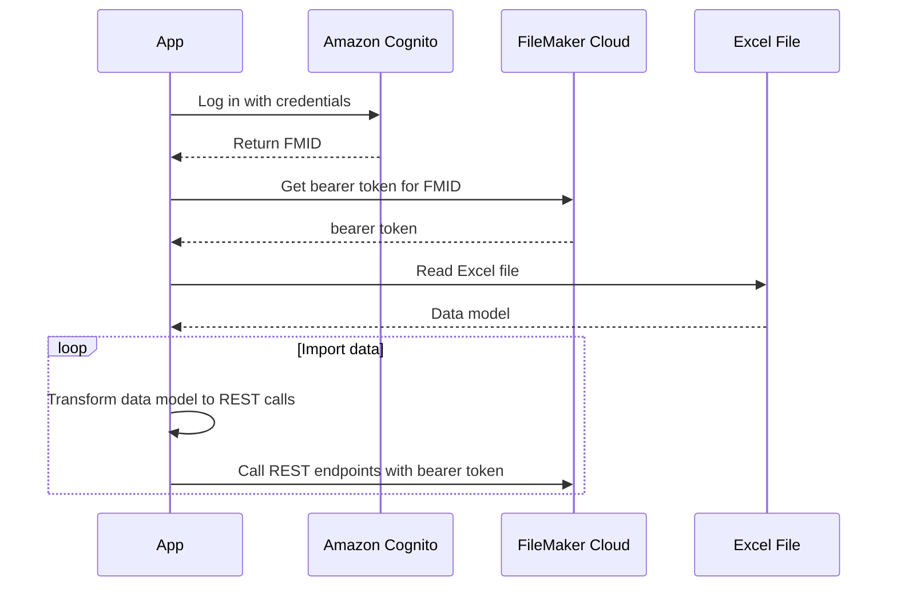
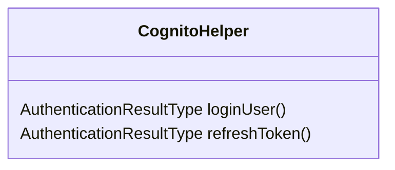
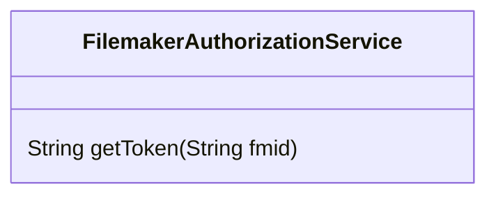
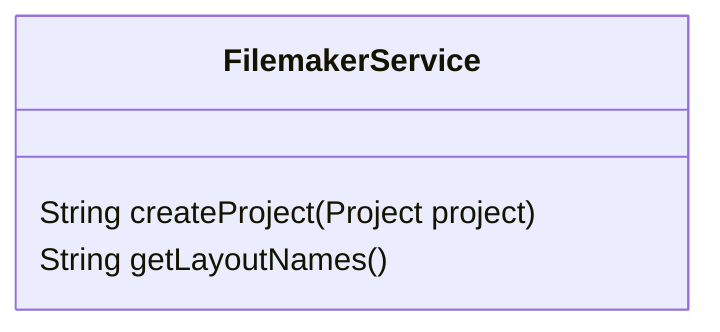

# Claris FileMaker Data API Sample

This application imports data from an Excel file into a FileMaker cloud database by using the [Claris FileMaker Data API](https://help.claris.com/en/data-api-guide/content/index.html). This is a reduced version of a larger one which I used to import a complex Excel file to fill and link multiple FileMaker tables. It took a considerable amount of time to build this import, so I would like to share the result as a minimal example.

## Import Workflow

In the past it was possible to directly login to the Claris FileMaker cloud with the user credentials. This doesn't work anymore. Instead one has to authenticate at an Amazon Cognito instance to receive the FMID. The FMID is used for authentication at the FileMaker Data API which returns a bearer token. The bearer token finally can be used for calling the REST API.



## Involved classes
The sample uses the following classes to implement the above scenario.

The `Main` class is the executable application which triggers reading the Excel file and calling the REST API.


The `CognitoHelper` handles the login at Amazon Cognito and persists/loads once acquired tokens.


The `FilemakerAuthorizationApi` is used to trade a FMID for a bearer token.


The `FilemakerService` is used to call the FileMaker cloud REST API.


## Using the tool
1. FileMaker Cloud Admin Console: Enable the **FileMaker Data API** connector
2. Create a table with the name `projects` and the columns `id`, `project_id` and `name`.
3. Deactivate the option "Prohibit modification of value during data entry" of the `id` column.
4. Put your credentials and database configuration in the file `src/main/resources/config.properties`:  
   *USERNAME* - your username  
   *PASSWORD* - your password  
   *HOSTNAME* - your team's host  
   *DATABASE* - your FileMaker database (aka 'app', target of the import)
5. Run the import tool  

## Additional informations

**Link records in different tables**  
To link two records in different tables just set the ID of the target row by the REST API. The now known ID can be set in the dependent record. Hint: To allow setting the ID by the REST API you have to deactivate the option "Prohibit modification of value during data entry" of the ID column. Otherwise you will get an error:

```
500 FileMaker Data API Engine Error  
{"messages":[{"code":"201","message":"Field cannot be modified"}],"response":{}}
```

## Credits
Cognito Login: https://github.com/aws-samples/aws-cognito-java-desktop-app  
